

# Promise Ibeh

### Cloud Engineer • AI Engineer • Cybersecurity Enthusiast • Full-Stack Developer

I build secure cloud infrastructure, intelligent applications, automation tools, and scalable web platforms that solve practical problems.

---

## About Me

I am a Cloud Engineer, AI Engineer, and Full-Stack Developer with an MSc in Information Technology from the National Open University of Nigeria, Abuja.

My work focuses on cloud computing, artificial intelligence, cybersecurity, automation, and modern web development. I enjoy building secure and practical technology that solves real-world problems.

## Professional Experience

### Mu-Matraymond Ventures Ltd
**Web & Cloud Developer**

- AI-assisted WordPress development and automation
- AWS cloud architecture and infrastructure management
- WordPress security hardening and optimization
- Website performance tuning and SEO improvements

### iTECH International Ltd
**Web Developer**

- Responsive web application development
- CMS customization and maintenance
- Front-end implementation with modern web technologies
- Website optimization and troubleshooting

### Freelance Web Developer
**Online Specialist**

- Corporate and e-commerce website development
- E-commerce website development and customization
- Server deployment and configuration
- Website maintenance and client support
- End-to-end project delivery

## Current Focus

- Artificial Intelligence
- Cloud Computing
- Cybersecurity
- Full-Stack Development
- Automation
- Open-source technologies

## Education

### MSc in Information Technology

National Open University of Nigeria, Abuja

### BSc in Computer Science

Ecole Superieure Sainte Felicite, Cotonou, Benin Republic

## Featured Projects

### Professional Portfolio Platform

A responsive portfolio platform showcasing projects, certifications, technical skills, and professional experience through a modern interface.

`React` `TypeScript` `Vite` `Tailwind CSS`

[View Live Portfolio](https://promiseibeh-portfolio.pages.dev/) · [View Repository](https://github.com/promiseibehdev/promiseibeh-portfolio)

---

### PromiseAgricTech — In Development

A digital agriculture platform designed to connect farmers, customers, investors, vendors, and agricultural service providers through one integrated marketplace.

`React` `Firebase` `Tailwind CSS`

---

### School Check Automation

A Python automation tool for retrieving and organizing educational records while reducing repetitive manual work.

`Python` `Automation`

---

### Localized AI Inference Sandbox

A local AI development environment for experimenting with open-source language models and AI-assisted development workflows.

`Ollama` `LM Studio` `Python`

---

### High-Availability AWS Cloud Infrastructure

A cloud infrastructure project demonstrating secure networking, compute services, monitoring, and infrastructure best practices.

`AWS` `EC2` `VPC` `IAM` `CloudWatch`

---

### Corporate Web Portal and CMS Hardening

A professional web portal focused on responsive design, performance optimization, and CMS security.

`WordPress` `PHP` `CSS` `Web Security`

---

### WooCommerce Storefront and Security Hardening

A secure WooCommerce storefront featuring payment integration, performance optimization, and WordPress security hardening.

`WordPress` `WooCommerce` `Nginx` `MySQL`

## Technologies

## Certifications

- AWS Technical Essentials
- AWS Cloud Practitioner Essentials
- Data Science Essentials with Python — Cisco
- Ethical Hacker — Cisco
- Data Science and Analytics — HP LIFE
- Introduction to Python — SoloLearn
- Introduction to HTML — SoloLearn
- Soft Skills Training — Jobberman

## GitHub Analytics

 

## Connect

- Portfolio: [promiseibeh-portfolio.pages.dev](https://promiseibeh-portfolio.pages.dev/)
- LinkedIn: [Promise Ibeh](https://www.linkedin.com/in/promise-ibeh-msc-01591b209/)
- Email: [promiseibeh6@gmail.com](mailto:promiseibeh6@gmail.com)
- GitHub: [@promiseibehdev](https://github.com/promiseibehdev)

---

### Building secure, scalable, and intelligent software that creates real-world impact.

